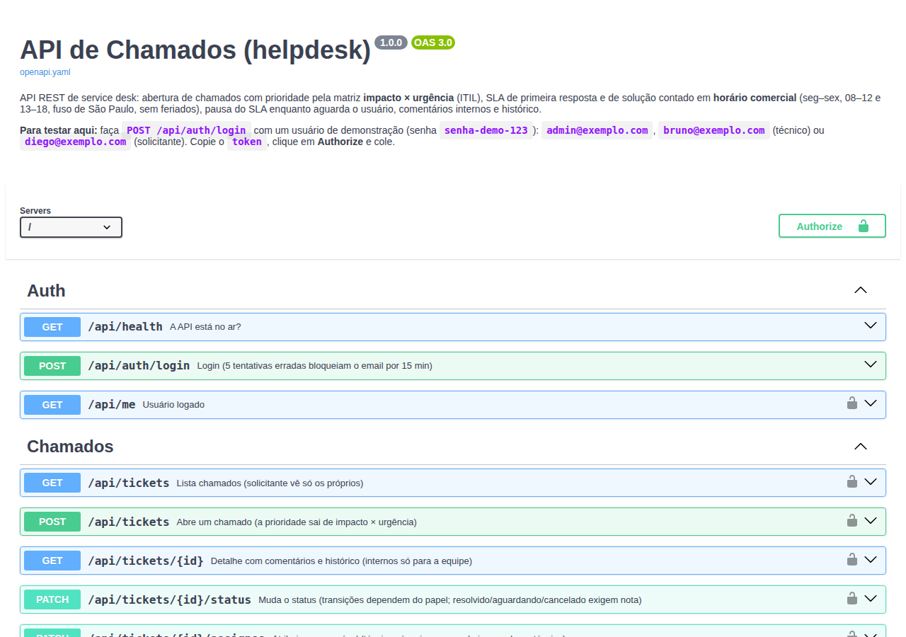

# API de Chamados

API REST de **service desk** em **PHP 8 puro**, sem framework: abertura de chamados, fila da equipe, comentários internos, histórico e **SLA contado em horário comercial**.

A ideia veio do meu dia a dia no service desk: as regras são as que a gente usa de verdade. A prioridade sai da matriz impacto × urgência, o relógio para quando o chamado está esperando o usuário, e o comentário interno não aparece para quem abriu.



**Stack:** PHP 8.3+ (enums, readonly, match) · PDO · MySQL 8 ou SQLite · JWT (HS256) · PHPUnit 11 · OpenAPI 3 + Swagger UI · Docker (Apache) · GitHub Actions (testes em SQLite **e** MySQL, PHP 8.3 e 8.4)

## Regras de negócio

**Prioridade (ITIL).** Quem abre o chamado não escolhe "urgente"; informa o **impacto** e a **urgência**, e a prioridade é calculada:

| impacto \ urgência | alta | média | baixa |
|---|---|---|---|
| **alto** | crítica | alta | média |
| **médio** | alta | média | baixa |
| **baixo** | média | baixa | baixa |

A equipe pode corrigir a prioridade informando o motivo; os prazos são recalculados.

**SLA em horário comercial.** Seg–sex, 08:00–12:00 e 13:00–18:00 (9 h/dia), no fuso de São Paulo, sem contar os feriados configurados.

| prioridade | 1ª resposta | solução |
|---|---|---|
| crítica | 30 min | 4 h |
| alta | 1 h | 9 h (1 dia útil) |
| média | 4 h | 18 h (2 dias úteis) |
| baixa | 9 h | 45 h (5 dias úteis) |

- **Primeira resposta** é a primeira ação pública da equipe (assumir o chamado ou comentar). Comentário interno não conta.
- **Pausa:** em `aguardando_usuario` o relógio da solução para. Quando o solicitante responde, o chamado volta sozinho para `em_atendimento` e o prazo é empurrado pelo tempo útil parado.

**Ciclo de vida.**

```
aberto ──► em_atendimento ──► aguardando_usuario
  │              │    ▲             │
  │              ▼    │             │
  │          resolvido ◄────────────┘
  │           │     │
  ▼           ▼     └──► em_atendimento (reaberto)
cancelado   fechado
```

| quem | pode |
|---|---|
| solicitante | abrir; ver e comentar só os **próprios** chamados; cancelar enquanto `aberto`; confirmar (`fechado`) ou reabrir quando `resolvido` |
| técnico | ver a fila toda; assumir (vira responsável); conduzir o status; comentar internamente; atribuir a si mesmo |
| admin | tudo do técnico + redistribuir chamados e gerenciar usuários |

Ir para `aguardando_usuario`, `resolvido` ou `cancelado` exige uma nota, que vira comentário público.

## Endpoints

| método | rota | descrição |
|---|---|---|
| POST | `/api/auth/login` | JWT válido por 8 h (5 erros em 15 min bloqueiam o email) |
| GET | `/api/me` | usuário logado |
| GET | `/api/tickets` | filtros `status`, `priority`, `category`, `assignee` (id, `me`, `none`), `overdue`, `q`; `sort` (`-priority`, `resolution_due_at`…); `page`, `per_page` |
| POST | `/api/tickets` | abre chamado |
| GET | `/api/tickets/{id}` | detalhe, comentários, histórico e `allowed_status` |
| PATCH | `/api/tickets/{id}/status` · `/assignee` · `/priority` | ciclo de vida, atribuição, prioridade |
| POST | `/api/tickets/{id}/comments` | comentário público ou interno |
| GET | `/api/metrics` | fila por status/prioridade/categoria, atrasados, % no SLA |
| GET · POST · PATCH | `/api/users` | gestão de usuários (admin) |

A documentação completa (com "Try it out") fica em **`/docs.html`**. Os erros sempre têm o mesmo formato:

```json
{ "error": { "code": "validation_error", "message": "Dados inválidos", "details": { "title": "Obrigatório" } } }
```

## Rodando

**Só com PHP** (SQLite, sem instalar nada):

```bash
cp .env.example .env
php bin/seed.php                              # cria o banco e os dados de demonstração
php -S localhost:8080 -t public public/index.php
# abra http://localhost:8080/docs.html
```

**Com Docker** (API + MySQL):

```bash
docker compose up --build                     # http://localhost:8080/docs.html
```

Usuários de demonstração (senha `senha-demo-123`): `admin@exemplo.com`, `bruno@exemplo.com` e `carla@exemplo.com` (técnicos), `diego@exemplo.com`, `elisa@exemplo.com` e `fabio@exemplo.com` (solicitantes). Os dados são fictícios.

```bash
TOKEN=$(curl -s -X POST localhost:8080/api/auth/login -H 'Content-Type: application/json' \
  -d '{"email":"bruno@exemplo.com","password":"senha-demo-123"}' | jq -r .token)
curl -s "localhost:8080/api/tickets?overdue=1&sort=-priority" -H "Authorization: Bearer $TOKEN" | jq
```

## Testes

```bash
composer install
vendor/bin/phpunit                            # 51 testes, SQLite em memória
TEST_DB_DSN="mysql:host=127.0.0.1;dbname=chamados_test" TEST_DB_USER=app TEST_DB_PASSWORD=app vendor/bin/phpunit
```

- **Calendário útil:** almoço, virada de dia, fim de semana, feriado, e a propriedade "somar N minutos e depois medir dá N".
- **JWT:** expiração, payload adulterado, `alg: none`, segredo diferente.
- **API inteira em memória** (sem servidor HTTP): login e bloqueio por tentativas, permissões, ciclo de vida completo, pausa de SLA, filtro de atrasados, comentários internos, paginação, ordenação e indicadores.
- **Documentação:** um teste falha se alguma rota do `App` não estiver no `openapi.yaml`.

O CI roda tudo em PHP 8.3 e 8.4, uma vez com SQLite e outra com MySQL 8 de verdade.

## Arquitetura

```
public/index.php        front controller (+ docs.html e openapi.yaml)
src/
  App.php               injeta dependências e registra as rotas; handle(Request): Response
  Http/                 Request, Response, Router, Validator, HttpException
  Auth/Jwt.php          HS256 sem dependência
  Domain/               regras puras: BusinessCalendar, Sla, Priority, TicketStatus, Role…
  Service/              TicketService, AuthService, MetricsService
  Repository/           SQL com PDO (prepared statements)
  Seeder.php            dados de demonstração criados pela própria API
database/schema.*.sql   schema para MySQL e para SQLite
```

### Decisões

- **Sem framework, de propósito.** Roteamento, validação, injeção de dependência e JWT ficam à vista, em poucas linhas. Em um projeto de equipe eu usaria Laravel ou Slim; aqui o objetivo é mostrar o que eles fazem por baixo.
- **`App::handle()` é uma função pura de Request para Response.** Os testes de integração chamam direto, sem subir servidor, e o mesmo código roda no `php -S` e no Apache.
- **Relógio injetável (`Clock`).** Prazos de SLA dependem da hora; nos testes o tempo é congelado e avançado de propósito ("o usuário respondeu 3 h depois").
- **Prazos gravados no banco**, não só calculados na leitura. Assim o filtro `overdue` e o indicador de atrasados são um `WHERE` com índice. Eles são recalculados quando a prioridade muda ou quando uma pausa termina.
- **Segurança:**
  - todo SQL usa prepared statements; colunas de ordenação vêm de uma lista fixa;
  - senhas com `password_hash`;
  - o JWT rejeita `alg` diferente de HS256 e compara a assinatura em tempo constante;
  - o login não revela se o email existe;
  - o usuário é relido do banco a cada requisição, então desativar a conta corta o acesso na hora;
  - o solicitante recebe 404 (não 403) em chamado de outra pessoa.
- **Datas em UTC** no banco (`AAAA-MM-DD HH:MM:SS`) e ISO 8601 com `Z` na API; o fuso de São Paulo só entra no cálculo do horário comercial.

## Próximos passos

- Front-end (Vue ou React) para a fila da equipe.
- Notificação por email quando o SLA estiver perto de estourar.
- Anexos (prints de erro).
- Pesquisa de satisfação ao fechar o chamado.

## Autor

Ademar C. Neto
